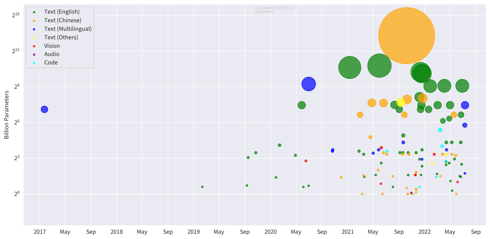
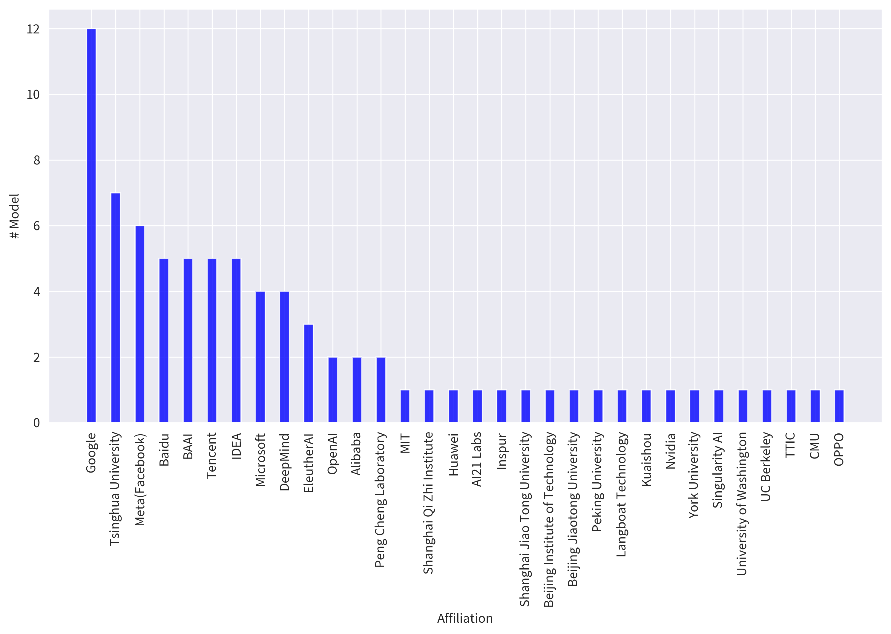
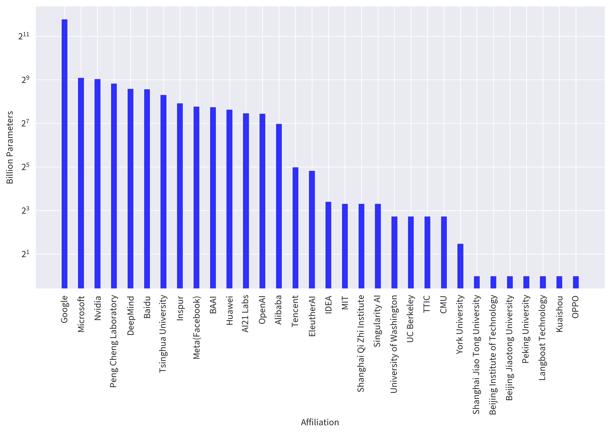

<div align="center">

<h1>BMList</h1>

**A List for Big Models**

</div>

# Introduction

Welcome to BMList! We wish to use this list to show the recent trend of big models.

In BMList, we list models that:

1. Have more than 1 billion parameters;
2. Have been publicly released either by a paper, an artice or a piece of news;
3. Focus on text processing (we promise other models like vision or code models are coming soon!).

Note that some info we listed may not be accurate. If there are any typos or mistakes, please feel free to raise issues or pull requests!


# Demos

We found it is limited to show all information of big models in the GitHub repo. So that we use this repo to store raw information and provide two ways to get more info about big models.


## Multi-dimensional Table

We show big models in a [multidimensional table](https://a0qwpgc3qv.feishu.cn/base/bascn2lp9dYCNe6GKdRd5sfPwhd), which is easy to show more info and classify models by organizations/languages.

## Big Model Gallery

We publish a [website]() to show statistics of big models. 

Now the figures are limited, and we welcome ideas for new figures.


### Big Model Trend



### Model Numbers by Organizations



### Model Parameters by Organizations



(In this figure we simply add up parameter sizes of each model published by each organization)

# Contribution

We welcome everyone to provide new models. To add a new model, the only thing you need is to add a new yaml file in the ``big_models`` folder. Once you uploaded the model, we will update the multi-dimensional table and the website. Don't worry about that!

Here are steps to add a model:

1. Create a yaml file with the name ``English_Model_Name(中文模型名称，如果有).yml``. An example is ``BigModel(大模型).yml``

2. Add the model info in the file. You can read ``format.json`` to know the format of the yaml file. An example is:

```
name: BigModel(大模型)
release_date: 2022/01/01
affiliation:
  - OpenBMB
  - ModelBest
language:
  - English
  - Chinese
paper/news: https://the-link-to-the-paper-or-news
parameters_dense:
  - 1B
  - 10B
parameters_MoE:
  - 100B
  - 1000B
model: https://the-link-to-the-model
code: https://the-link-to-the-code
api: https://the-link-to-the-api
```

Note that ``name``, ``release_date``, ``affiliation`` and ``language`` are required and either ``parameters_dense`` or ``parameters_MoE`` is required.

3. Propose a pull request!


## Contributors

<a href="https://github.com/OpenBMB/BMList/graphs/contributors">
  
</a> 
