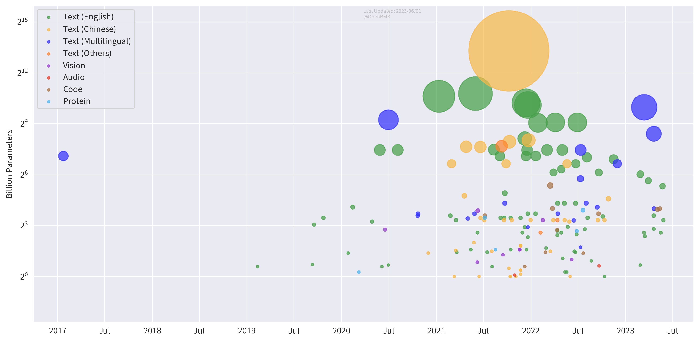

<h1>BMList</h1>

**A List of Big Models**

# Introduction

Welcome to BMList! We wish to use this list to show the recent trend of big models.

In BMList, we list models that:

1. Have at least 1 billion parameters;
2. Have been publicly released either by a paper, an artice or a piece of news;

If you find any typos or mistakes in this repo, please feel free to create issues or pull requests!

# Model Expo

We find that it is not intuitive to show all information about big models in a GitHub repo. So we use this repo to store raw data and provide two ways to present more information.

## Big Model List

We show all information of big models in a [multi-dimensional table](https://a0qwpgc3qv.feishu.cn/base/bascn2lp9dYCNe6GKdRd5sfPwhd), which is easy to classify models by organizations, languages, domains, etc.

## Big Model Gallery

We maintain a [website]() to show statistics of big models. 

In the website, we currently present five figures, which are previewed below. Any ideas for new figures are welcomed!

### Big Model Trend

### Model Numbers by Organizations

### Model Parameters by Organizations

### Model Numbers by Time

### Model Parameters by Time

# Contribution

We welcome everyone to add new models. Please check our [contributing guidelines](https://github.com/OpenBMB/BMList/blob/main/CONTRIBUTING.md) to see how to contribute.

Once you added a model, the multi-dimensional table and the website will be updated. Don't worry about that!

## Contributors

 
