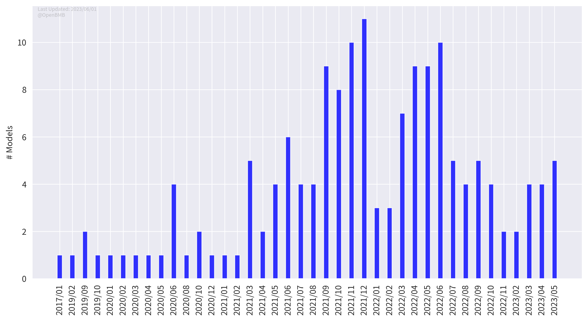
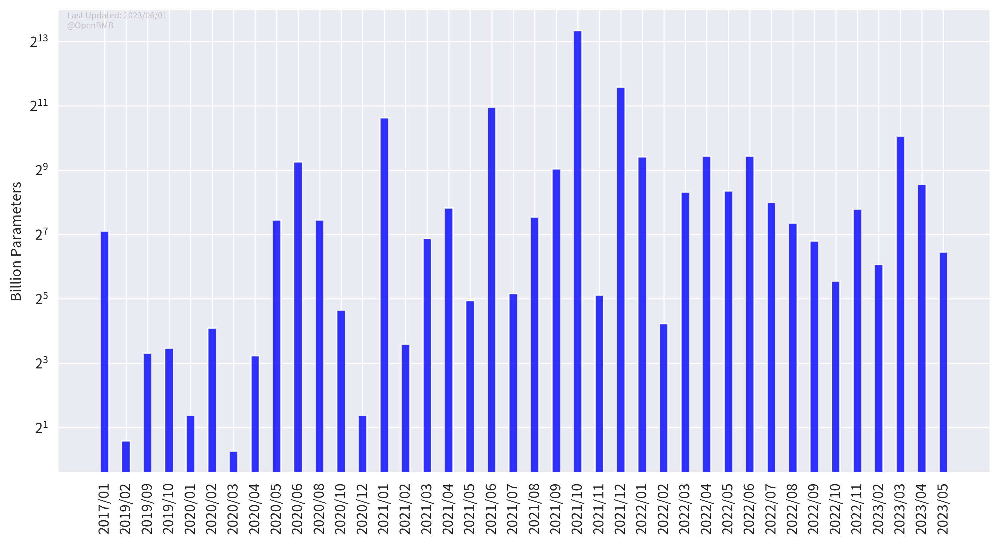

<h1>BMList</h1>

**A List of Big Models**

# Introduction

Welcome to BMList! We wish to use this list to show the recent trend of big models.

In BMList, we list models that:

1. Have at least 1 billion parameters;
2. Have been publicly released either by a paper, an artice or a piece of news.

If you find any typos or mistakes in this repo, please feel free to create issues or pull requests!

# What's New

* 2022/08/05 We have upgraded the multi-dimensional table, and now you can filter the records as you wish!

# Model Expo

**We maintain a [website](https://openbmb.github.io/BMList) to show statistics of big models from multiple perspectives.**

## Big Model List

We show all information of big models in a [multi-dimensional table](https://openbmb.github.io/BMList/list), in which you can easily classify models by organizations, languages, domains, etc.

## Big Model Gallery

We also host a gallery to present figures about big models. Currently, there are five figures, previewed below, and any ideas for new figures are welcomed!

### Big Model Trend

### Model Numbers by Organizations

### Model Parameters by Organizations

### Model Numbers by Time

### Model Parameters by Time

# Contribution

We welcome everyone to add new models. Please check our [contributing guidelines](https://github.com/OpenBMB/BMList/blob/main/CONTRIBUTING.md) to see how to contribute.

Once you added a model, the multi-dimensional table and the website will be automatically updated. Don't worry about that!

## Contributors

 
